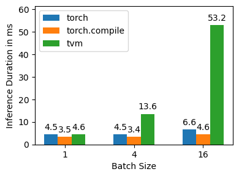
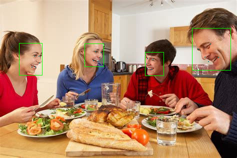

# 机器学习工具、平台与系统作业

## 深度神经网络编译器：以 TVM 与 PyTorch 2.0 为例

### 结果

|    | model_name                 | test_item     |   batch_size |   compile_time_s |   infer_time_mean_ms |
|---:|:---------------------------|:--------------|-------------:|-----------------:|---------------------:|
|  0 | facebook/convnext-tiny-224 | torch         |            1 |        /       |              4.47948 |
|  1 | facebook/convnext-tiny-224 | torch_compile |            1 |          2.57027 |              3.45069 |
|  2 | facebook/convnext-tiny-224 | tvm           |            1 |         37.7127  |              4.57279 |
|  3 | facebook/convnext-tiny-224 | torch         |            4 |        /       |              4.4797  |
|  4 | facebook/convnext-tiny-224 | torch_compile |            4 |          2.05128 |              3.37868 |
|  5 | facebook/convnext-tiny-224 | tvm           |            4 |         43.3252  |             13.6116  |
|  6 | facebook/convnext-tiny-224 | torch         |           16 |        /       |              6.63025 |
|  7 | facebook/convnext-tiny-224 | torch_compile |           16 |          1.99523 |              4.62228 |
|  8 | facebook/convnext-tiny-224 | tvm           |           16 |         71.2845  |             53.154   |
|  9 | microsoft/resnet-50        | torch         |            1 |        /       |              5.51754 |
| 10 | microsoft/resnet-50        | torch_compile |            1 |          2.23461 |              3.12204 |
| 11 | microsoft/resnet-50        | tvm           |            1 |         62.4482  |              1.86983 |
| 12 | microsoft/resnet-50        | torch         |            4 |        /       |              5.56561 |
| 13 | microsoft/resnet-50        | torch_compile |            4 |          1.96603 |              3.04268 |
| 14 | microsoft/resnet-50        | tvm           |            4 |         66.6161  |              6.66447 |
| 15 | microsoft/resnet-50        | torch         |           16 |        /       |              5.58056 |
| 16 | microsoft/resnet-50        | torch_compile |           16 |          1.89306 |              4.17158 |
| 17 | microsoft/resnet-50        | tvm           |           16 |         66.1151  |              9.86793 |




### 环境

测试环境没有特殊要求，以下是我使用的环境：
- pytorch 2.1.0
- cuda 12.1.0

测试环境也需要nvcc，可以直接安装完整工具链（但这样似乎在同一环境里编译TVM和测试更方便）
```bash
conda install -c "nvidia/label/cuda-12.1.0" --override-channels cuda
```

### TVM安装

找不到新版本或支持较新的CUDA版本的TVM预编译包，但是从[源码编译](https://tvm.apache.org/docs/install/from_source.html)他是一个很痛苦的过程，这里记录一下编译的过程。

```bash
# 应对中国大陆特殊网络环境，建议配置ssh.github.com或代理
git clone --branch v0.16.0 --depth 1 git@github.com:apache/tvm.git
cd tvm
sed -i 's/https:\/\/github.com\//git@github.com:/g' .gitmodules
git submodule sync
git submodule update --init --recursive

# 还好有conda
conda env create --file conda/build-environment.yaml
conda activate tvm-build

# 安装目标CUDA工具链，我觉得这个版本要和测试环境的CUDA版本一致
conda install nvidia/label/cuda-12.1.0::cuda

# 按照说明配置CUDA、LLVM等编译选项
mkdir build
cp cmake/config.cmake build
CONFIG_FILE="build/config.cmake"
sed -i 's/set(USE_CUDA OFF)/set(USE_CUDA ON)/g' $CONFIG_FILE
sed -i 's/set(USE_LLVM OFF)/set(USE_LLVM "llvm-config --link-static")/g' $CONFIG_FILE
echo -e '\n# Avoid potential symbol conflicts between different versions LLVM used by TVM and PyTorch\nset(HIDE_PRIVATE_SYMBOLS ON)' >> $CONFIG_FILE

# 依赖librhash.so.0，但是conda的rhash版本都已经1.x.x，所以需要手动创建一个软链接，希望不会有问题
ln -s $(readlink $CONDA_PREFIX/lib/librhash.so) $CONDA_PREFIX/lib/librhash.so.0

# 需要应对 -- Found CUDA_CUDA_LIBRARY=CUDA_CUDA_LIBRARY-NOTFOUND
cd build
cmake -DCMAKE_LIBRARY_PATH=$CONDA_PREFIX/lib/stubs ..
make -j4

# 如果没有错误，切换到测试环境
conda deactivate
conda activate your_devlopment_env
cd python
pip install .
```

### 测试

运行所有测试，注意修改变量以适配硬件环境

```bash
bash dl_compiler/benchmark_all.sh
```

## 深度神经网络模型部署：以 AI 推理框架 Tengine 为例

### 结果

分类任务


```bash
tengine-lite library version: 1.5-dev

model file : ./models/mobilenet.tmfile
image file : ./images/cat.jpg
img_h, img_w, scale[3], mean[3] : 224 224 , 0.017 0.017 0.017, 104.0 116.7 122.7
Repeat 1 times, thread 1, avg time 210.81 ms, max_time 210.81 ms, min_time 210.81 ms
--------------------------------------
8.574153, 282
7.880111, 277
7.812575, 278
7.286450, 263
6.357493, 281
--------------------------------------
```

人脸关键点检测任务


```bash
tengine-lite library version: 1.5-dev
Repeat [1] min 74.974 ms, max 74.974 ms, avg 74.974 ms
```

人脸检测任务



```bash
tengine-lite library version: 1.5-dev
img_h, img_w : 316, 474
Repeat 1 times, thread 1, avg time 154.97 ms, max_time 154.97 ms, min_time 154.97 ms
--------------------------------------
detected face num: 4
BOX 1.00:( 38.4053 , 86.142 ),( 46.3009 , 64.0174 )
BOX 0.99:( 384.076 , 56.9844 ),( 76.968 , 83.9609 )
BOX 0.99:( 169.196 , 87.1324 ),( 38.4133 , 46.8504 )
BOX 0.98:( 290.004 , 104.453 ),( 37.6345 , 46.7777 )
```

目标检测任务


```bash
tengine-lite library version: 1.5-dev
Repeat 1 times, thread 1, avg time 155.27 ms, max_time 155.27 ms, min_time 155.27 ms
--------------------------------------
Yolov3DetectionOutput init param[1]
 3:  93%, [ 454,   77,  684,  180], car
17:  75%, [ 122,  221,  366,  516], dog
 2:  54%, [ 243,  187,  589,  422], bicycle
 3:  53%, [ 690,  117,  729,  155], car
 1:  53%, [  64,   73,  114,  118], person
```


```bash
Image height not specified, use default 512
Image width not specified, use default  512
Scale value not specified, use default  0.017, 0.018, 0.017
Mean value not specified, use default   123.7, 116.3, 103.5
tengine-lite library version: 1.5-dev

model file : ./models/efficientdet.tmfile
image file : ./images/ssd_horse.jpg
img_h, img_w, scale[3], mean[3] : 512 512 , 0.017 0.018 0.017, 123.7 116.3 103.5
Repeat 1 times, thread 1, avg time 5432.70 ms, max_time 5432.70 ms, min_time 5432.70 ms
--------------------------------------
18:  85%, [ 215,   90,  425,  358], horse
 0:  71%, [ 429,  123,  449,  178], person
 0:  67%, [ 274,   16,  356,  228], person
 7:  56%, [   2,  105,  133,  197], truck
18:  56%, [ 142,  203,  196,  346], horse
 0:  27%, [ 419,  136,  427,  150], person
 7:  25%, [ 467,  148,  498,  175], truck
 0:  25%, [ 412,  135,  420,  151], person
63:  24%, [ 176,  134,  202,  158], potted plant
```

### Tengine 编译

既然适合嵌入式，那么直接交叉编译全平台的Tengine，Codespaces启动！

```bash
git checkout tengine-lite
sudo apt update
sudo apt install cmake make g++ git g++-aarch64-linux-gnu g++-arm-linux-gnueabihf
bash scripts/build.sh
```

`Raspberry Pi 4B + 64-bit Debian` 对应架构文件夹 `build-aarch64-linux-gnu`。

```bash
tar -czvf tengine-lite-build-aarch64-linux-gnu.tar.gz build-aarch64-linux-gnu
# 上传到树莓派
tar -xzvf tengine-lite-build-aarch64-linux-gnu.tar.gz
```

哦，要运行 https://tengine.readthedocs.io/zh-cn/latest/quick_start/c_demo.html 的 demo，权重文件得手动从Google Drive下载（总比龟速网盘快），放到 `./models`，`./images`、`./files`则完整下载。

- 分类任务
    - mobilenet.tmfile
- 人脸关键点检测任务
    - landmark.tmfile
- 人脸检测任务
    - retinaface.tmfile
- 目标检测任务
    - yolo-fastest-1.1.tmfile
    - efficientdet.tmfile

```bash
bash demo.sh 2>&1 | tee demo.log
```
